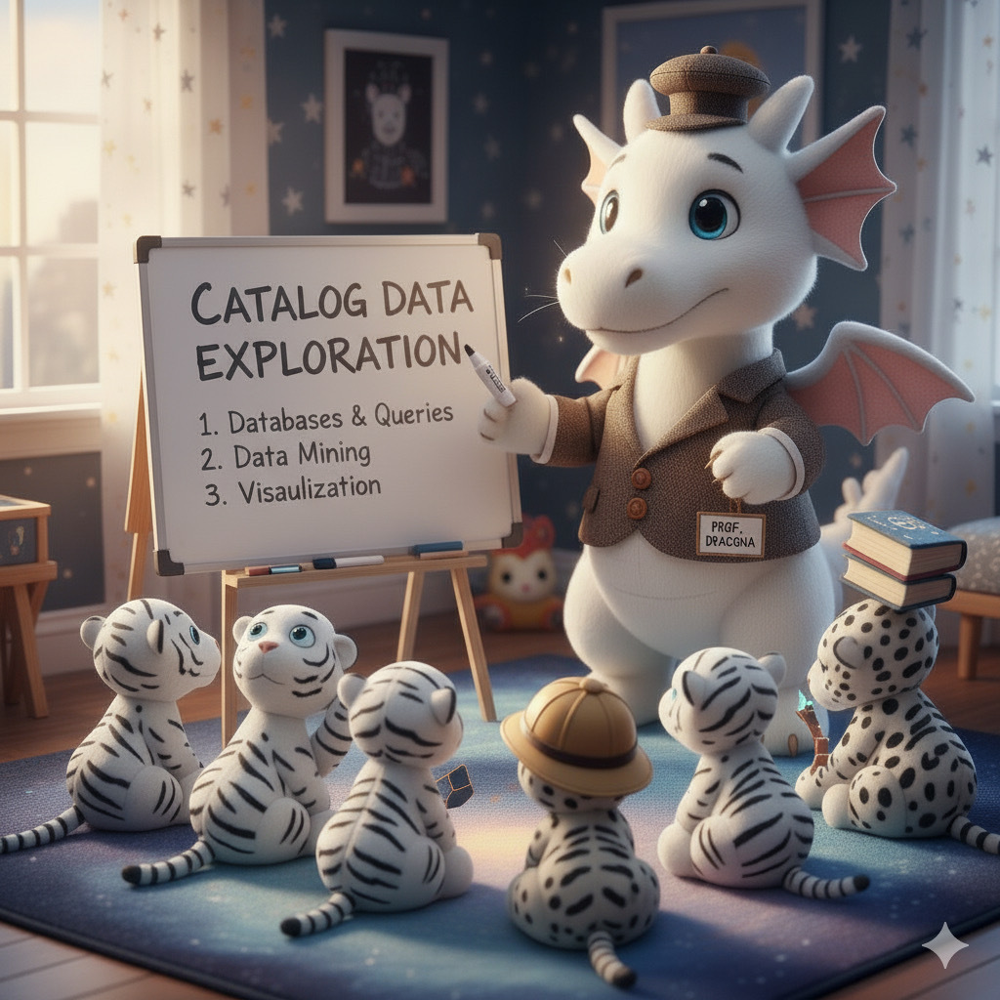

## Part 2: Reference data exploration

Goals: explore the Rubin photometric reference data provided, and understand some of the details, such as the limiting depth, the photometric uncertainties.

Specifics: I have provided you with some prepared photometric reference data, which includes cross-matched objects with known redshifts.   You will want to:

1. investigate the contents of the Rubin photometric reference data,
2. understand the limitations of the data, such as the limiting depth, the incompleteness of the reference data sets, and the limited spatial resolution.

Open the notebook `nb/Project_Part2.ipynb` to find a notebook you can work on this second part of the project in.

If you want to see what things should look like, you can have a look:

1. in the notebook [01_ExploreDESIFilters.ipynb](https://github.com/KIPAC/MACSS/blob/main/nb/01_ExploreDESIFilters.ipynb) to how the magnitudes as measured by Rubin compare with data from a different observatory.

2. in the notebook [02_ExploreInputs.ipynb](https://github.com/KIPAC/MACSS/blob/main/nb/02_ExploreInputs.ipynb) to see examples how the magnitudes and colors vary with redshift. 

3. in the notebook [03_LimitingMags.ipynb](https://github.com/KIPAC/MACSS/blob/main/nb/03_LimitingMags.ipynb) to see the effect of the cuts on the depth of the objects in the catalog.

4. in the notebook [04_CosmoRef.ipynb](https://github.com/KIPAC/MACSS/blob/main/nb/04_CosmoRef.ipynb) to see other ways the cosmology (and in particular the expansion of the universe) affect the data we are trying to use to estimate redshifts.

<!--  LocalWords:  macss nb 01_ExploreDESIFilters.ipynb
 -->
<!--  LocalWords:  02_ExploreInputs.ipynb 03_LimitingMags.ipynb
 -->
<!--  LocalWords:  04_CosmoRef.ipynb
 -->
