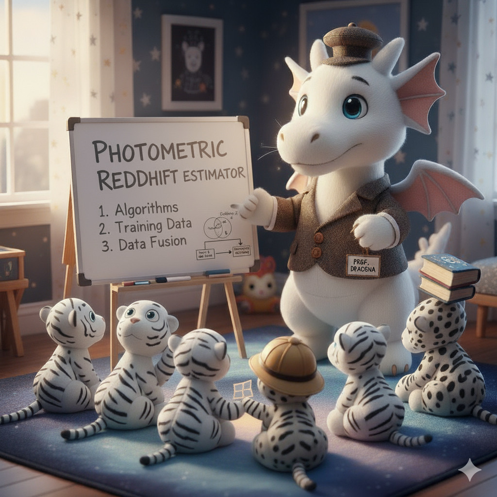

### Part 3: Creating and testing photometric redshift estimator

Goals: create a photometric redshift estimator using the scikit-learn tool-kit and test it out

Specifics: I have provided you with some prepared photometric reference data, which includes cross-matched objects with known redshifts.   You will want to:

1. prepare the data for consumption by the machine learning algorithms, 
2. use part of this data to train a regression model, 
3. apply that regression model to remainder of the data
4. investigate how well the regression model performed

Open the notebook `nb/Project_Part3.ipynb` to find a notebook you can work on this second part of the project in.

If you want to see what things should look like, you can have a look:

1. in the notebook [05_ExploreRedshift.ipynb](https://github.com/KIPAC/MACSS/blob/main/nb/05_ExploreRedshift.ipynb) to see an exploration of the features in the data that can be used to extract redshift information.

2. in the notebook [06_SklearnRegression.ipynb](https://github.com/KIPAC/MACSS/blob/main/nb/06_SklearnRegression.ipynb) to see examples of running several different types of estimation algorithms.

<!--  LocalWords:  scikit-learn nb 05_ExploreRedshift.ipynb
 -->
<!--  LocalWords:  06_SklearnRegression.ipynb
 -->
